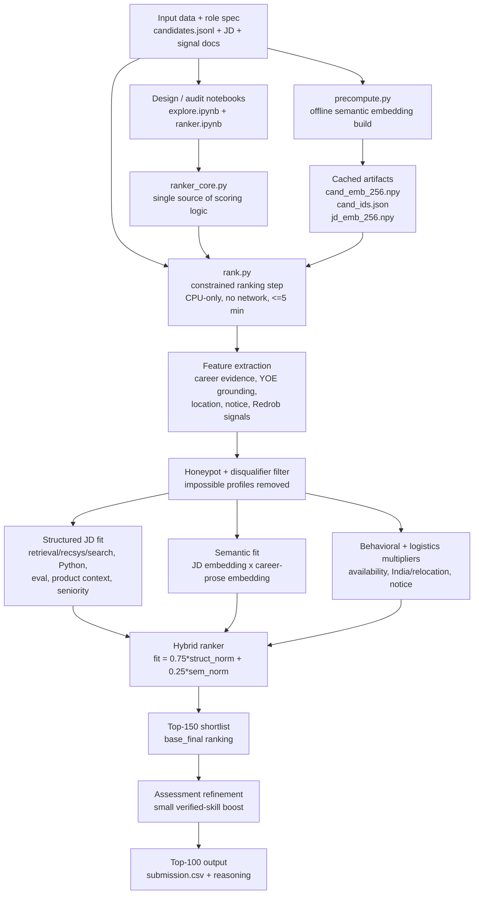

# IndiaRun - Intelligent Candidate Discovery & Ranking

Solution for the Redrob **Intelligent Candidate Discovery & Ranking Challenge**: rank the top 100
of 100,000 candidates against the Senior AI Engineer JD - seeing **semantic fit beyond keywords**,
integrating profile / career / behavioral signals, and excluding the planted **honeypot** candidates.

## Approach - a hybrid ranker

Structured evidence **gates** domain fit; the embedding model **fine-ranks**; behavioral and
logistics signals **modulate** availability. Honeypots and disqualified profiles are removed first.

```
fit        = 0.75 * struct_norm + 0.25 * sem_norm
base_final = fit * behavioral * logistics * experience_mult * early_band_mult
final      = 0.95 * base_norm(top-150) + 0.05 * assessment_refine   # top-150 -> top-100
```

- `struct_norm` - normalized structured JD-fit score from `ranker_core.struct_score`: experience,
  applied ML tenure, Python evidence, production retrieval/recsys/search evidence, vector/hybrid
  infrastructure, ranking evaluation, product-company context, location, and anti-fit penalties.
- `sem_norm` - normalized cosine similarity between the JD query embedding and the candidate's
  career prose embedding. This catches candidates who built matching/recommendation/search systems
  without using the exact JD keywords.
- `fit` - blended quality score before availability/logistics. Structured evidence gets 75% weight
  so keyword/embedding similarity cannot overpower actual career evidence.
- `behavioral` - availability multiplier from Redrob signals: recruiter response rate, recency,
  interview completion, response speed, open-to-work, and offer acceptance.
- `logistics` - India/location/relocation/notice-period multiplier. India-based preferred-location
  candidates with short notice are favored; non-India candidates are heavily suppressed because the
  JD has no sponsorship.
- `experience_mult` - JD experience preference: peaks at 6-8 years, keeps 5-9 years strong, and
  allows exceptional 4-5 year candidates without letting them dominate.
- `early_band_mult` - extra safeguard for 4.0-4.5 year candidates; they need strong retrieval/prod
  evidence and verified assessment strength to remain competitive.
- `base_final` - main ranking score used to pick a top-150 shortlist after fit, behavioral,
  logistics, and experience constraints are applied.
- `assessment_refine` - small second-stage boost from verified skill assessments. It only moves
  candidates within the top-150 shortlist and cannot rescue weak JD-fit profiles.
- `final` - published score used for the top-100 CSV: mostly normalized `base_final`, with a 5%
  assessment refinement.

- **Structured fit** (`struct_score`) - explicit JD-derived weights: experience band (peaks at the
  JD's ideal 6-8 yrs), applied-ML years, strong-Python evidence, verified Redrob IR assessment,
  production-retrieval / vector-infra / ranking-evaluation prose, ML title, product-company context,
  graded location. Hard **disqualifiers** (-> tier 0): under-min experience, consulting-only career,
  non-eng title without ML, CV/speech-without-NLP, pure-research-without-production, impossible YOE.
  **Penalties**: title-chasing, framework-demo-only, recent-LLM-only, closed-source-no-validation,
  CV-primary-with-weak-IR.
- **Semantic fit** - `bge-small-en-v1.5` cosine of the JD query vs each candidate's **career prose**
  (summary + titles + descriptions, *not* the noise skill list). Embeddings are precomputed + cached.
- **Behavioral multiplier** (~0.19-0.93) - 6 redrob signals: recruiter-response rate, recency,
  interview-completion, response-speed, open-to-work, offer-acceptance (JD directive #3).
- **Logistics multiplier** - India eligibility, JD-city / relocation, notice period; no visa sponsorship.
- **Assessment refinement + gates** - a 40% verified-assessment pass floor; missing scores imputed
  from structured strength; a stricter hard gate for the 4.0-4.5 early-career band.
- **Honeypot exclusion** - an impossibility battery (skill/experience anachronisms, company-founded-
  after dates, overlapping jobs, expert-skill-with-0-months, tenure/YOE contradictions). Rare
  contradictions = deliberate plants and are dropped before ranking (0 of ~80 reach the top-100).

## Repo layout

### Canonical files

- `rank.py` is the **canonical reproduction entrypoint**. Reviewers should run this to generate the
  final CSV under the 5-minute CPU/no-network constraint.
- `ranker_core.py` is the **canonical scoring implementation**. All production ranking constants,
  feature extraction, honeypot checks, behavioral/logistics scoring, and reasoning generation live
  here.
- `notebooks/` is the **canonical design record**. The notebooks explain how the features, weights,
  honeypot checks, and audits were developed, but they are not the Stage-3 reproduction entrypoint.

| Path | What |
|------|------|
| `rank.py` | **Canonical reproducer** - the <=5-min CPU/no-network step that produces `submission.csv` |
| `precompute.py` | Offline embedding generation (the slow step that may exceed 5 min) |
| `ranker_core.py` | Single source of truth - constants, features, honeypot battery, scoring, blend, reasoning |
| `requirements.txt` | Pinned dependencies |
| `notebooks/explore.ipynb` | **Design record** - feature extraction, honeypot analysis, structured scoring, diagnostics |
| `notebooks/ranker.ipynb` | **Design record** - semantic encode, hybrid blend, top-100 audit |
| `artifacts/` | Cached embeddings + generated outputs (git-ignored; regenerate embeddings with `precompute.py`) |

`rank.py` / `ranker_core.py` are authoritative for reproduction; the notebooks are the exploration and
methodology record - how the features, weights, honeypot checks, and audits were developed. The
notebooks produce the **same top-100 ranking** as `rank.py`; `rank.py` pins a reference date so the
reasoning timestamps are deterministic across re-runs.

## System architecture



## Reproduce the submission

The 487 MB candidate pool is supplied separately; symlink or copy it to `data/candidates.jsonl`
(`.jsonl` or `.jsonl.gz` both work).

```bash
pip install -r requirements.txt

# (one-time, offline - encodes 100k candidates with bge-small; GPU/MPS used if available)
python precompute.py --candidates ./data/candidates.jsonl --artifacts ./artifacts

# the ranking step - produces the submission
python rank.py --candidates ./data/candidates.jsonl --out ./submission.csv
```

If the cached embedding artifacts are already present (`artifacts/cand_emb_256.npy`,
`cand_ids.json`, `jd_emb_256.npy`), **skip `precompute.py`** - `rank.py` recomputes every structured
/ behavioral / blend score live and only loads the embeddings.

### Compute-constraint compliance - the ranking step (spec Section 3)

These constraints apply to the **ranking step** (`rank.py`), which is what produces the CSV. The
one-time offline `precompute.py` is exempt: the spec permits it to use a GPU and exceed 5 minutes.

| Constraint | Limit | This solution (`rank.py`) |
|---|---|---|
| Ranking runtime | <= 5 min | **~34 s** |
| Memory | <= 16 GB | well under |
| Compute | CPU only | uses no model/GPU (pure numpy dot-product). `precompute.py` auto-uses MPS/GPU if present, else CPU (exempt) |
| Network | off | no network/API calls (`precompute.py` downloads the model once, offline) |

`rank.py` imports only `numpy` + `pandas` and loads cached embedding arrays; it never touches a
model or the network. Only the offline `precompute.py` uses `sentence-transformers`/`torch` and a
GPU/MPS, which the spec explicitly permits.

## Dependencies

`rank.py` needs only `numpy` + `pandas`. `precompute.py` additionally needs `torch` +
`sentence-transformers` (one-time embedding build). Versions pinned in `requirements.txt`.
